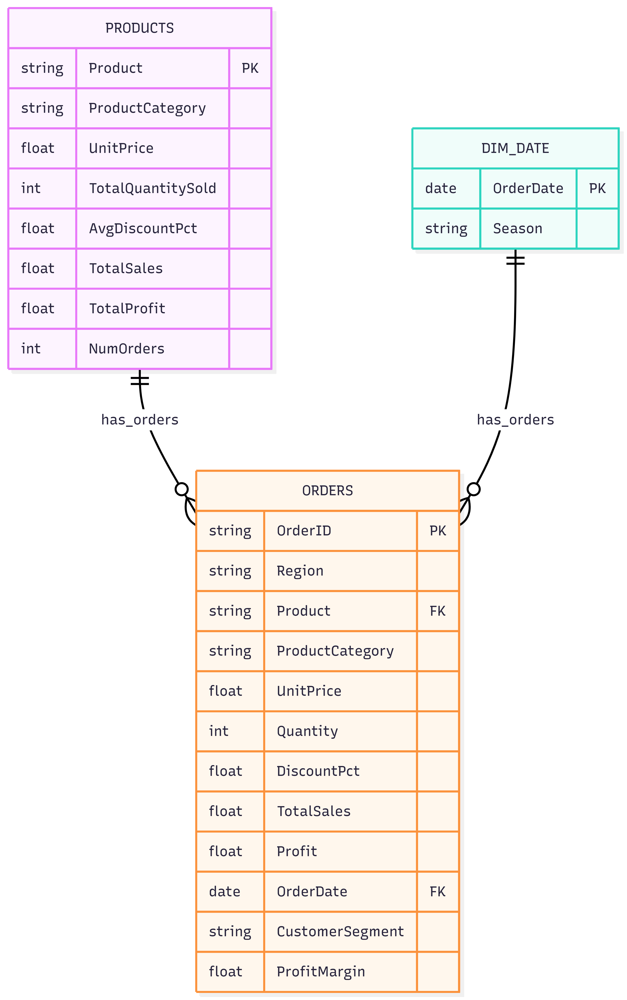

# Superstore Sales Analysis: From SQL to Dashboard

This project analyzes a fictional superstore’s sales data using MySQL, Python, and Power BI to support data‑driven product and marketing decisions.

---

## Business question

**Main question**

> Which products should the superstore prioritize in each region, customer segment, and season to increase sales and profit?

**Sub‑questions**

- Which products and categories generate the highest sales and profit overall.  
- How sales and profit differ across regions, customer segments, and seasons.  
- Which products are high volume / high frequency versus niche items, and how should they be managed.  

---

## Data and schema

The data is stored in a MySQL database called `superstore` and mirrored as CSV files for easier reuse.

### Tables

- **`orders`** – fact table of order lines:  
  `OrderID`, `Region`, `Product`, `ProductCategory`, `UnitPrice`, `Quantity`, `DiscountPct`, `TotalSales`, `Profit`, `OrderDate`, `CustomerSegment`, `ProfitMargin`.  

- **`products`** – product dimension with aggregated metrics:  
  `Product` (PK), `ProductCategory`, `UnitPrice`, `TotalQuantitySold`, `AvgDiscountPct`, `TotalSales`, `TotalProfit`, `NumOrders`.  

- **`dim_date`** – calendar dimension:  
  `OrderDate` (PK), `Season`.

### Relationships

- `orders.Product` → `products.Product` (many‑to‑one).  
- `orders.OrderDate` → `dim_date.OrderDate` (many‑to‑one).  

The SQL script `Portfolio.sql` creates the schema, loads data, builds `dim_date`, and defines foreign keys.

---

## ETL and tools

The project follows a simple **ETL** flow implemented across SQL, Python, and Power BI.

### Extract

- Orders and products exported as CSVs and loaded into MySQL and Power BI.

### Transform

- Data type cleanup and standardization in MySQL.  
- Creation of `dim_date` from unique `OrderDate` and `Season` values.  
- Calculation of `ProfitMargin` and product‑level totals (sales, profit, quantity, order count).  
- Classification of products into quadrants: High/Low Volume × High/Low Frequency using the median of `TotalQuantitySold` and `NumOrders`.

### Load / Consume

- **Python notebook** (`Untitled.ipynb`) for exploratory data analysis and tabular outputs.  
- **Power BI report** (`Dashboard.pbix`) for interactive exploration by region, segment, and season.

### Tech stack

- **Database**: MySQL  
- **Programming**: Python (pandas, mysql‑connector‑python)  
- **BI & Visualization**: Power BI Desktop  

---

## Key analyses and insights

The notebook and dashboard are organized to answer the main business question using the underlying data model.

### Product and category performance

- Aggregate `TotalSales`, `TotalProfit`, and `NumOrders` per product and category from the `products` table.  
- Identify top‑performing items that should be prioritized globally.

### Regional, segment, and seasonal patterns

- Group `orders` by `Region`, `CustomerSegment`, and `Season` (via `dim_date`) to measure sales and profit.  
- Highlight where certain products or categories perform especially well or poorly.

### Product portfolio quadrants

- Compute median `TotalQuantitySold` and `NumOrders` to define “High” vs “Low”.  
- Assign each product to one of four quadrants (e.g. High Volume / High Frequency) to support stocking and promotion decisions.

### Main findings (summary)

- High‑volume, high‑frequency products (Bread, Chair, Jacket, Jeans, Smartphone, Soda) are the core revenue drivers and should be prioritized in inventory and promotions.  
- Milk sells frequently but in lower total volume, suggesting it is a repeat‑purchase staple that benefits from consistent availability across regions and seasons.  
- Products like Cheese, Coffee, Headphones, T‑Shirt, and Tea are lower volume and frequency and can be used as niche or add‑on items rather than primary stock.  
- Seasonal and regional breakdowns in the dashboard indicate **when** and **where** to push each of these product groups to maximize sales and profit.

### Dashboard views (Power BI)

- KPI cards for Total Sales, Total Profit, and Number of Orders.  
- Sales and profit by Region and Customer Segment with interactive slicers.  
- Sales and profit by Product Category and top products.  
- Seasonal performance using `dim_date` to analyze when to push which products.

---

## How to run the project

### 1. Database setup 

1. Create the database and tables by running `Portfolio.sql` in MySQL Workbench.  
2. Import the CSV files:  
   - `superstore_orders_table_adjusted.csv` → `superstore.orders`  
   - `superstore_products_table_consistent_v2.csv` → `superstore.products`

### 2. Python analysis

1. Open `Untitled.ipynb` in Jupyter Notebook or VS Code.  
2. Install dependencies, for example:  
   ```bash
   pip install pandas mysql-connector-python

## Entity-Relationship Diagram

The following ER diagram illustrates the data model used in the Superstore Sales Analysis project, including the fact table (`orders`) and supporting dimension tables (`products`, `dim_date`).


